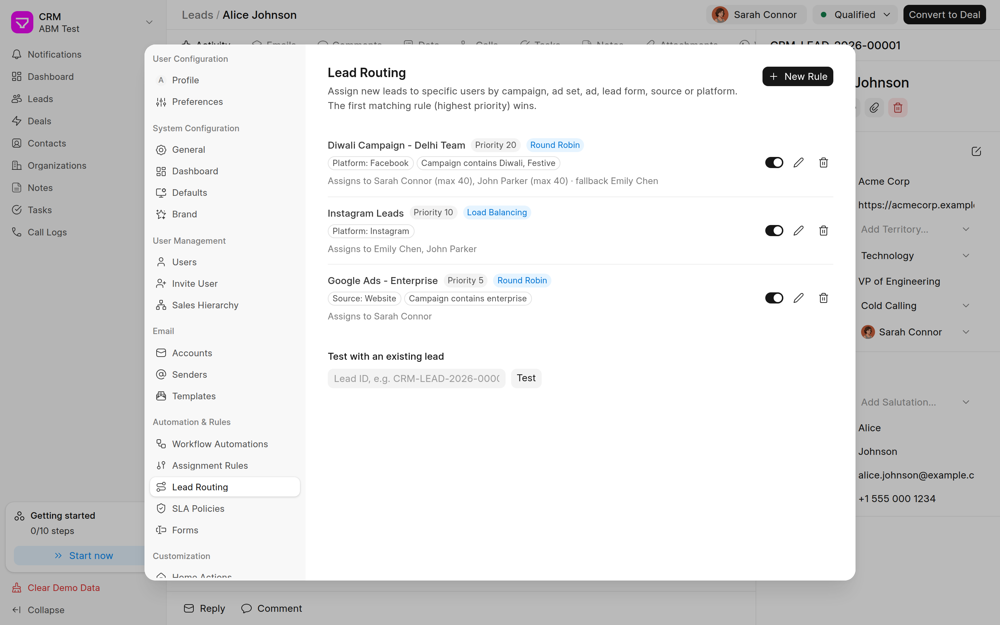
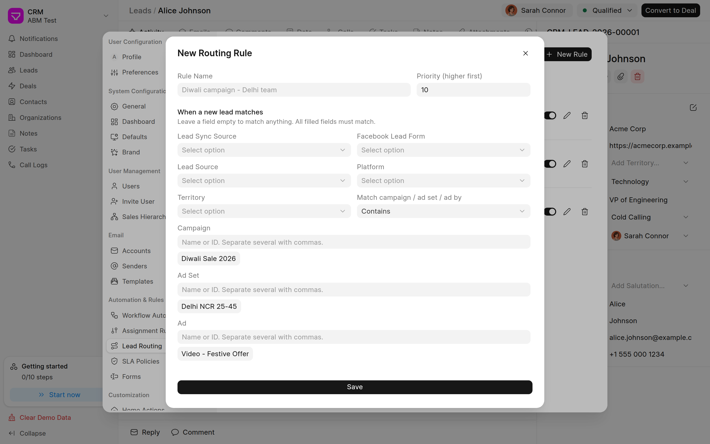

<div align="center">

# ABM CRM

**A free, self-hosted sales CRM for teams that run on performance marketing.**<br>
Built on top of [Frappe CRM](https://github.com/frappe/crm): everything it does, plus lead routing by
campaign, per-user sender emails, working WhatsApp, and clearer setup errors.

[](https://github.com/ABM-Tech-Pvt-Ltd/abm_crm/actions/workflows/ci.yml)
[](license.txt)
[](https://frappe.io/framework)
[](https://github.com/frappe/crm)

[Features](#features) · [Install](#installation) · [Setup](#setup) · [How it works](#how-it-works) · [Roadmap](ROADMAP.md)



</div>

## Why

Frappe CRM is a great open-source CRM. ABM CRM adds what Indian SMB sales teams asked us for most:
leads from Facebook and Instagram campaigns going to the right people automatically, reps sending
from their own email addresses, and WhatsApp that works out of the box. You run it on your own
server, with no per-user fees.

ABM CRM is an add-on app. It never edits Frappe CRM's code, so you keep getting upstream updates.

## Features

**Lead routing by campaign**
- Rules that send new leads to specific users based on Facebook/Instagram **campaign, ad set, ad**,
  lead form, lead sync source, lead source, platform, territory, or any Python condition.
- **Round robin** or **load balancing** (fewest open leads). Per-user **max open leads** cap and a
  fallback user when everyone is busy.
- Priorities: the highest-priority matching rule wins. Leads with an owner are never touched. Leads
  that match no rule fall through to the standard Assignment Rules.
- Facebook leads get their campaign, ad set, ad and platform fetched from the Graph API and saved on
  the lead (and on the deal after conversion), so you can filter and report by campaign.
- "Test with an existing lead" shows which rule and user a lead would get.

**Email**
- **Choose the sender** in the lead/deal email composer. Admins map email accounts to users, roles
  or everyone, and mark a default.
- Optional **enforcement**: block sending from addresses a user isn't allowed to use.
- The email account setup shows the real reason a connection fails, e.g. "Gmail needs an App
  Password", instead of a generic "invalid credentials". It only tests incoming mail when incoming is on.

**Call and WhatsApp in one tap**
- **Call / WhatsApp / Email** buttons on every lead and deal, and call/WhatsApp buttons on every row of
  the mobile lists. Call opens the phone dialer; WhatsApp opens the chat.
- **Free WhatsApp (Click to Chat)**: the WhatsApp tab lists predefined templates (with the lead's
  name filled in). Tap one, edit it, and "Open in WhatsApp" opens the rep's own WhatsApp app or
  WhatsApp Web with the message typed in. No Meta account, no per-message cost. Every message is
  logged on the lead. Templates are managed in Settings > WhatsApp Templates.

**Made for phones**
- **Bottom navigation**: Leads, Deals, Tasks, Alerts, and More for everything else.
- **Card lists** for leads and deals instead of tables that scroll sideways.
- A Call / WhatsApp / Email bar at the top of every lead and deal.

**WhatsApp Cloud API** (optional, with [frappe_whatsapp](https://github.com/shridarpatil/frappe_whatsapp) and Meta's Cloud API)
- Numbers saved without a country code (`9876543210`) are sent in international format (`919876543210`).
- Meta errors in plain words: number not on the test allowed list, 24-hour window closed, expired
  token, and more.
- The WhatsApp tab appears as soon as an account is activated, without a reload.
- Step-by-step setup, including free testing with Meta's test number: [WHATSAPP.md](WHATSAPP.md).

**Plus everything in Frappe CRM:** leads, deals, contacts, organizations, kanban, email, calls
(Twilio/Exotel), tasks, notes, SLAs, dashboards, workflow automations, Facebook lead sync, mobile views.

<p align="center">
  
</p>

## Installation

Requirements: a [Frappe bench](https://github.com/frappe/bench) with Frappe **v16** and Node 20+.

```bash
cd ~/frappe-bench

# 1. Frappe CRM (required)
bench get-app crm https://github.com/frappe/crm --branch main

# 2. ABM CRM (install it after crm: it serves its own build at /crm)
bench get-app https://github.com/ABM-Tech-Pvt-Ltd/abm_crm --branch main

# 3. Optional: WhatsApp
bench get-app https://github.com/shridarpatil/frappe_whatsapp --branch master

bench --site your-site install-app crm abm_crm
bench --site your-site install-app frappe_whatsapp   # optional
bench --site your-site migrate
bench build --app abm_crm
```

Open `https://your-site/crm`.

> Don't install another app that also serves `/crm` on the same site.

## Setup

### Lead routing
Settings → Automation & Rules → **Lead Routing** → New Rule. Pick the conditions, such as Campaign
contains `diwali` and Platform is `Instagram`. Then add users with an optional open-lead cap, and pick
round robin or load balancing.

Facebook campaign names need the `ads_read` permission on the lead sync token. Without it, only
campaign IDs are stored, so match by ID.

### Email senders
1. Settings → Email → **Accounts**: add one account per sender address, with outgoing turned on.
   Only System Managers can add accounts.
2. Settings → Email → **Senders**: map each account to a user, a role or everyone.
3. Optional: turn on **Enforce sender rules**.

**Gmail** needs an [App Password](https://myaccount.google.com/apppasswords) (2-Step Verification
must be on); your normal password is always rejected. **Outlook / Office 365** mostly requires OAuth,
set up from desk.

### WhatsApp
Free by default (**Click to Chat**). Edit the templates in Settings → **WhatsApp Templates**, where you
can also switch to the Cloud API. For the Cloud API, see [WHATSAPP.md](WHATSAPP.md): creating the Meta app, free test number, tokens, webhook with a free
tunnel, costs, and common errors.

### Phone numbers
Numbers saved without a country code use **Default Phone Region** in ABM CRM Settings
(`/app/abm-crm-settings`, default `IN`).

## How it works

```
apps/abm_crm/
├── abm_crm/
│   ├── hooks.py                  # doc_events + method overrides; never patches crm's code
│   ├── lead_routing.py           # routing engine (CRM Lead.before_insert)
│   ├── api/                      # whitelisted APIs: email senders, email accounts, routing, WhatsApp
│   ├── abm_crm/doctype/          # ABM CRM Settings, ABM Email Sender, ABM Lead Routing Rule
│   ├── setup/install.py          # custom fields, created in code on install and migrate
│   ├── patches/                  # one-time data patches
│   ├── tests/                    # integration tests (bench run-tests --app abm_crm)
│   └── www/crm.py                # re-exports crm's page context for our /crm build
└── frontend/
    ├── vite.config.js            # builds apps/crm/frontend with our overrides on top
    └── src_override/             # files that replace or extend crm's frontend
```

- **Backend:** routing, sender checks and phone normalisation run in `doc_events`. Crm's email-account
  and WhatsApp send methods are replaced with `override_whitelisted_methods`. Custom fields are created
  in code, so there is no fixture drift.
- **Frontend:** `vite.config.js` builds Frappe CRM's own frontend source, and nothing is copied. A file
  at `frontend/src_override/<path>` replaces `crm/frontend/src/<path>`, however it is imported. New
  files can also live there. Overrides stay small, so crm upgrades stay easy.
- **Current overrides:**
  - `components/EmailEditor.vue` (sender picker)
  - `components/Settings/Settings.vue` (adds Senders and Lead Routing)
  - `components/Settings/EmailAdd.vue` and `EmailEdit.vue` (real errors)
  - `composables/whatsapp.js` (WhatsApp mode, refreshes status)
  - `pages/Lead.vue`, `Deal.vue`, `MobileLead.vue`, `MobileDeal.vue` (call/WhatsApp/email buttons)
  - `components/Activities/Activities.vue` and `ActivityHeader.vue` (Click to Chat tab)
  - `components/ListViews/LeadsListView.vue` and `DealsListView.vue` (cards on phones)
  - `components/Layouts/MobileLayout.vue` and `components/Mobile/MobileAppHeader.vue` (bottom navigation)
- **New components:**
  - `components/Settings/EmailSenders.vue`, `LeadRouting.vue`, `WhatsAppTemplates.vue`
  - `components/ABM/` (`ContactActions`, `QuickWhatsApp`, `MobileRecordCards`)
  - `components/Mobile/MobileBottomNav.vue`

### Frontend development

The frontend uses crm's `node_modules`:

```bash
cd apps/crm/frontend && yarn install
cd ../../abm_crm && yarn dev      # hot reload
yarn build                        # writes abm_crm/public/frontend and abm_crm/www/crm.html
```

Rebuild ABM CRM after every Frappe CRM upgrade.

### Tests

```bash
bench --site your-test-site set-config allow_tests true
bench --site your-test-site run-tests --app abm_crm
```

## Roadmap

Next up: phone numbers stored in `+91` format, WhatsApp templates with variables, tasks created
automatically per status, lead ageing report, missed-call leads, required fields per status,
accept-or-pass for new leads, and ad spend with cost per lead for each campaign.
Full list: [ROADMAP.md](ROADMAP.md).

## Contributing

Issues and pull requests are welcome. See [CONTRIBUTING.md](CONTRIBUTING.md).

## License

[GNU AGPL v3](license.txt), the same license as Frappe CRM, which this app extends and partly modifies.
If you run a modified version for users over a network, you must offer them its source code.

ABM CRM is developed by **ABM Tech Pvt Ltd**. It is not affiliated with or endorsed by Frappe
Technologies. "Frappe" is a trademark of its owner.
